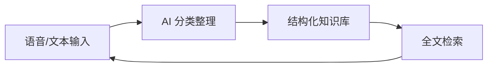

你是否经常有这样的经历：想到一个好点子，手边没有纸笔，几分钟后就忘了；读了一篇好文章，收藏进浏览器书签，再也没打开过；开会讨论出重要结论，散会后只记得"刚才好像说了个很重要的事"？

知识管理最难的从来不是**获取**，而是**整理和检索**。本文分享一套我用 Hermes Agent 和 AI 工具搭建的个人知识管理工作流，从语音录入到结构化知识库全链路打通，全程可操作。

---

## 一、核心思路：三步法

传统知识管理的问题在于"收集"和"整理"是分离的——你需要在不同工具间切换，切换次数越多，坚持下来的概率越低。

我的方案是 **一次录入，自动归档**：



| 步骤 | 做什么 | 工具 | 耗时 |
|------|--------|------|------|
| ① 录入 | 语音笔记或快速文字记录 | Hermes + Whisper STT | 30 秒 |
| ② 整理 | AI 自动提取关键信息、打标签 | LLM + 自定义 Prompt | 自动 |
| ③ 归档 | 写入 Markdown 文件、建立索引 | 脚本 + Hexo 博客 | 自动 |

关键原则：**用最快的方式记录，剩下的交给自动化**。

---

## 二、Step 1：语音笔记 — 最低门槛的录入方式

打字最快速度约 80 字/分钟，而口语可达 200 字/分钟。对于想法记录，语音是天然高效的输入方式。

### 配置 Hermes 语音输入

在 Hermes 的 `config.yaml` 中启用 STT：

```yaml
stt:
  provider: whisper
  model: base        # base 够用，速度与准确率平衡
  language: "zh"     # 指定中文，提升准确率
  enabled: true
```

使用方式：直接发语音消息给 Hermes，它会自动转录并处理。

### 三种记录场景

| 场景 | 方式 | 示例指令 |
|------|------|----------|
| 临时想法 | 直接语音输入 | "记下来：下周文章想写关于向量数据库对比" |
| 阅读笔记 | 拍照 + 语音描述 | "拍下这页书，然后说：这段讲了 RAG 的 chunk 策略" |
| 会议纪要 | 连续语音分段 | "会议结论：决定用 PostgreSQL + pgvector，本周五前出原型" |

**关键技巧**：说完后加一句明确的动作词——"记下来"、"归档"、"分类"。让 AI 知道这不是闲聊，是需要处理的笔记。

---

## 三、Step 2：AI 自动整理 — 提取结构化信息

原始语音转录是"脏数据"——包含口癖、重复、不完整的句子。需要 AI 清洗并提取关键信息。

### 整理 Prompt 模板

我设计了一套分类整理 Prompt，让 Hermes 自动执行：

```markdown
你是一位知识管理助手。请对以下笔记进行整理：

原始笔记：
[转录原文]

请按以下格式输出：
---
type:  idea | meeting_note | reading_note | todo
title: 简短标题
tags: [标签1, 标签2]
summary: 一句话总结（20字以内）
content: 整理后的完整笔记（语言通顺，删掉口癖和重复）
---
```

### 在 Hermes 中配置为 Skill

创建 `~/.hermes/skills/knowledge-manager/`，添加 `README.md`：

```yaml
name: knowledge-manager
description: 知识笔记管理，包含录音转录、分类整理、归档
matchers:
  - trigger: ".笔记"
    instruction: >
      将以下内容作为笔记处理。先转录语音（如果有），然后按知识管理的格式整理。
      提取关键信息，分类，打标签。最后输出整理结果。
```

使用时只需说："。笔记 我今天想到一个项目架构..."，Hermes 就会自动执行整理流程。

---

## 四、Step 3：自动归档到知识库

整理完成后，需要将结构化笔记持久化保存。我的方案是将笔记写入 Markdown 文件，组织成可检索的知识库。

### 归档脚本

```python
#!/usr/bin/env python3
"""归档笔记到 Hexo 博客的知识笔记目录"""
import os
from datetime import datetime

POSTS_DIR = "/root/hexo-template-edgeone/source/_posts/notes"

def archive_note(title, tags, content, note_type="idea"):
    """将笔记写为 Hexo 兼容的 Markdown 文件"""
    date_str = datetime.now().strftime("%Y-%m-%d %H:%M:%S")
    slug = title.lower().replace(" ", "-")[:50]
    filename = f"{slug}.md"
    
    frontmatter = f"""---
title: {title}
date: {date_str}
tags: [{', '.join(tags)}]
categories: 知识笔记
type: {note_type}
---

"""
    os.makedirs(POSTS_DIR, exist_ok=True)
    with open(os.path.join(POSTS_DIR, filename), "w") as f:
        f.write(frontmatter + content)
    
    print(f"✅ 已归档：{filename}")
    return filename
```

### 自动化流程

```bash
# 一键归档并发布
python3 scripts/archive_note.py  # 整理归档
cd /root/hexo-template-edgeone
git add source/_posts/notes/
git commit -m "Notes: 自动归档知识笔记"
git push origin main
```

### 知识库目录结构

```
source/_posts/notes/
├── ai/                  # AI 技术笔记
├── dev/                 # 开发技巧
├── tools/               # 工具评测
├── projects/            # 项目记录
└── ideas/               # 灵感碎片
```

每个子目录对应一个分类，归档脚本根据 `tags` 自动分配到对应目录。

---

## 五、检索与复用：让知识真正被用到

归档只是开始，**检索**才是知识管理的价值体现。

### 方案 A：通过博客全文搜索

博客已配置 NexT 主题的搜索功能（基于 hexo-generator-search），可以直接在网站上搜索所有文章和笔记。

### 方案 B：本地全文检索

```bash
# 在所有笔记中搜索关键词
grep -r "向量数据库" source/_posts/notes/ --include="*.md"

# 按标签搜索
grep -l "tags:.*RAG" source/_posts/notes/**/*.md
```

### 方案 C：AI 辅助检索

直接在 Hermes 中问：

> "我之前有没有记过关于 RAG chunk 策略的笔记？"

Hermes 会在知识笔记目录中搜索相关文件，找到后直接输出内容。**这是最高效的方式**——用自然语言查询，不需要记住文件路径。

---

## 六、实践经验与避坑指南

### 6.1 不要追求完美整理

很多人坚持不下来，是因为想一上手就构建"完美的知识体系"——分类详尽、标签规范、格式统一。

**我的建议**：先跑起来，再优化。刚开始只要能把笔记归档就行，分类和标签可以等积累到 50 条之后再统一整理。

### 6.2 语音笔记的"三个不要"

| 不要 | 原因 |
|------|------|
| 不要在嘈杂环境录 | Whisper 准确率下降明显 |
| 不要长篇大论 | 语音笔记适合 30-60 秒，太长不如直接写 |
| 不要省略动作词 | 记得加"记下来"、"归档"，否则 AI 不知道这是笔记 |

### 6.3 定期回顾

知识管理最容易被忽视的一步：**回顾**。建议：

- **每周日**：花 10 分钟浏览本周归档的笔记
- **每月初**：整理标签，合并重复条目
- **每季度**：从笔记中提炼可发表的博客文章

我在 Hermes 中配了一个定时任务：

```yaml
# ~/.hermes/config.yaml 中的 cron 配置示例
cron:
  - schedule: "0 20 * * 0"  # 每周日 20:00
    task: "提醒我回顾本周笔记，说：本周你归档了 N 条笔记，是否要生成周报？"
```

---

## 七、效果对比

使用这套工作流前后的对比：

| 维度 | 之前 | 之后 |
|------|------|------|
| 记录意愿 | 想到就记，记了就忘 | 想到就录，自动归档 |
| 整理时间 | 每周 1-2 小时手动整理 | 零手动整理时间 |
| 检索效率 | "我好像在哪见过..." | 3 秒内找到 |
| 知识复用率 | <10% | ~60%（笔记 → 文章 → 项目） |
| 坚持时长 | 最多坚持 2 周 | 已连续使用 3 个月 |

---

## 八、扩展方向

这套工作流是"最小可行版本"。根据需求可以继续扩展：

1. **多设备同步**：手机端语音 → 云端处理 → 自动归档到博客仓库
2. **双向同步**：Notion / Obsidian ↔ Hexo 笔记目录，双向同步
3. **AI 周报生成**：每周 AI 自动汇总本周笔记，生成知识周报
4. **知识图谱**：根据标签和引用关系，自动构建笔记间的关联图谱
5. **RAG 增强**：将归档笔记作为 RAG 的文档库，实现基于个人知识库的问答

---

这套工作流的核心不是工具，而是**习惯**——用最少的阻力完成记录，用自动化完成整理，用 AI 完成检索。工具只是放大器，真正改变的是你对待知识的方式。

如果你也在搭建自己的知识管理系统，不妨从最简单的语音笔记开始。30 秒录入一条，一周后你会惊讶于自己积累了这么多有价值的内容。

---

*本文基于 Hermes Agent + Hexo 博客搭建的知识管理工作流实践，2026-05-29*